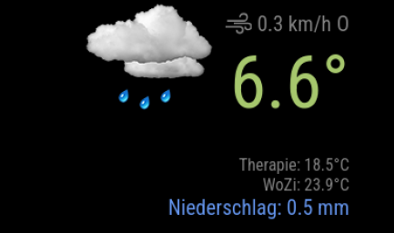

# MMM-My-Actual-Weather

MagicMirror² Modul für aktuelle Wetterdaten von einer eigenen Personal Weather Station (PWS) mit API-Fallback.

## Features

- **PWS Push-Empfang**: HTTP-Server empfängt Daten direkt von der Wetterstation (z.B. Ecowitt, Ambient Weather)
- **API-Fallback**: Automatischer Wechsel zu Wunderground API wenn PWS nicht erreichbar
- **State Machine**: Saubere Koordination zwischen PWS und API-Datenquellen
- **Zusatzsensoren**: Unterstützung für bis zu 2 zusätzliche Temperatursensoren
- **Temperatur-Farbgradient**: Temperaturabhängige Farbdarstellung (konfigurierbar)
- **Tag/Nacht-Icons**: Automatische Anpassung der Wetter-Icons basierend auf Sonnenauf-/untergang
- **Mehrsprachig**: Deutsch und Englisch

## Screenshot



## Layout

Das Modul verwendet ein einfaches 2-Zeilen Table-Layout:

```
┌─────────────┬──────────────────────┐
│   WETTER-   │  Wind-Info           │
│    ICON     │  TEMPERATUR          │
├─────────────┼──────────────────────┤
│   (leer)    │  Sensor 1            │
│             │  Sensor 2            │
│             │  Niederschlag        │
└─────────────┴──────────────────────┘
```

- **Zeile 1**: Wetter-Icon (links) neben Wind-Info und Temperatur (rechts)
- **Zeile 2**: Sensordaten und Niederschlag (rechtsbündig)
- Wind-Icon: `wi-strong-wind` aus Weather Icons Font

## Installation

```bash
cd ~/MagicMirror/modules
git clone https://github.com/rkorell/MMM-My-Actual-Weather.git
cd MMM-My-Actual-Weather
npm install
```

## Konfiguration

Füge folgendes zu deiner `config/config.js` hinzu:

```javascript
{
    module: "MMM-My-Actual-Weather",
    position: "top_right",
    config: {
        // Wunderground API (Pflicht)
        stationId: "DEINE_STATION_ID",
        apiKey: "DEIN_API_KEY",

        // Standort für Tag/Nacht-Berechnung und Open-Meteo (Pflicht)
        latitude: 50.242,
        longitude: 6.603,

        // PWS Push-Server
        pwsPushPort: 8000,           // Port für HTTP-Server (0 = deaktiviert)
        pwsPushInterval: 60,         // Erwartetes Push-Intervall in Sekunden

        // Zusatzsensoren
        showSensor1: true,
        showSensor2: true,
        sensor1Name: "WoZi",
        sensor2Name: "Therapie"
    }
}
```

## Alle Konfigurationsoptionen

| Option | Typ | Standard | Beschreibung |
|--------|-----|----------|--------------|
| **API-Einstellungen** |
| `stationId` | String | - | Wunderground Station ID (Pflicht) |
| `apiKey` | String | - | Wunderground API Key (Pflicht) |
| `baseURL` | String | `https://api.weather.com/...` | Wunderground API URL |
| `openMeteoUrl` | String | `https://api.open-meteo.com/...` | Open-Meteo API URL |
| `latitude` | Number | `null` | Breitengrad (Pflicht) |
| `longitude` | Number | `null` | Längengrad (Pflicht) |
| `units` | String | `"m"` | Einheiten: `"m"` (metrisch), `"e"` (imperial) |
| `updateInterval` | Number | `300000` | Update-Intervall in ms (5 Min) |
| **PWS Push-Server** |
| `pwsPushPort` | Number | `8000` | HTTP-Server Port (0 = deaktiviert) |
| `pwsPushInterval` | Number | `60` | Erwartetes Push-Intervall (Sekunden) |
| `pwsPushFallbackTimeout` | Number | `180` | Timeout für API-Fallback (Sekunden) |
| **Sensoren** |
| `showSensor1` | Boolean | `false` | Sensor 1 anzeigen |
| `showSensor2` | Boolean | `false` | Sensor 2 anzeigen |
| `sensor1Name` | String | `"WoZi"` | Anzeigename Sensor 1 |
| `sensor2Name` | String | `"Therapie"` | Anzeigename Sensor 2 |
| `sensorTextColor` | String | `"lightgray"` | Textfarbe für Sensoren |
| **Darstellung** |
| `decimalPlacesTemp` | Number | `1` | Dezimalstellen Temperatur |
| `decimalPlacesPrecip` | Number | `1` | Dezimalstellen Niederschlag |
| `windColor` | String | `"white"` | Farbe für Windanzeige |
| `precipitationColor` | String | `"white"` | Farbe für Niederschlag |
| `temperatureColor` | String | `"white"` | Temperaturfarbe (wenn `tempSensitive: false`) |
| `tempSensitive` | Boolean | `true` | Temperaturabhängige Farbgebung |
| `showDataSource` | Boolean | `true` | Zeitstempel bei PWS-Daten anzeigen |
| `animationSpeed` | Number | `1000` | Animationsgeschwindigkeit (ms) |
| `lang` | String | `config.language` | Sprache (de/en) |

## Temperatur-Farbgradient

Der Farbgradient kann angepasst werden:

```javascript
tempColorGradient: [
    { temp: -17, color: "Dodgerblue" },
    { temp: -8, color: "Blue" },
    { temp: 2, color: "LightBlue" },
    { temp: 8, color: "Yellow" },
    { temp: 15, color: "Gold" },
    { temp: 18, color: "Orange" },
    { temp: 25, color: "Darkorange" },
    { temp: 28, color: "Orangered" },
    { temp: 32, color: "Red" }
]
```

## PWS-Konfiguration

Die Wetterstation muss so konfiguriert werden, dass sie Daten per HTTP POST an den MagicMirror sendet:

- **URL**: `http://<MagicMirror-IP>:8000/data/report/`
- **Methode**: POST
- **Format**: URL-encoded (Standard für Ecowitt/Wunderground-kompatible Stationen)

### Unterstützte Felder

| Feld | Beschreibung |
|------|--------------|
| `tempf` | Außentemperatur (°F) |
| `windspeedmph` | Windgeschwindigkeit (mph) |
| `winddir` | Windrichtung (Grad) |
| `dailyrainin` | Tagesniederschlag (inches) |
| `temp1f` | Sensor 1 Temperatur (°F) |
| `humidity1` | Sensor 1 Luftfeuchtigkeit (%) |
| `temp2f` | Sensor 2 Temperatur (°F) |
| `humidity2` | Sensor 2 Luftfeuchtigkeit (%) |
| `dateutc` | Zeitstempel |

## State Machine

Das Modul verwendet eine State Machine für die Datenquellen-Koordination:

```
INITIALIZING → (PWS Push empfangen) → PWS_ACTIVE
     ↓ (3 Sek Timeout)
WAITING_FOR_PWS → (PWS Push empfangen) → PWS_ACTIVE
     ↓ (3x Push-Intervall Timeout)
API_ONLY → (60 Min Recheck) → INITIALIZING
```

- **INITIALIZING**: Warten auf ersten PWS-Push (max 3 Sekunden)
- **PWS_ACTIVE**: PWS liefert Daten, API nur für Icons
- **WAITING_FOR_PWS**: API-Daten anzeigen, auf PWS warten
- **API_ONLY**: Nur API-Daten, periodischer Recheck

## Abhängigkeiten

- `node-fetch` - HTTP-Requests
- `suncalc` - Sonnenauf-/untergangsberechnung

## Autor

Dr. Ralf Korell, 2025/2026

## Lizenz

MIT
