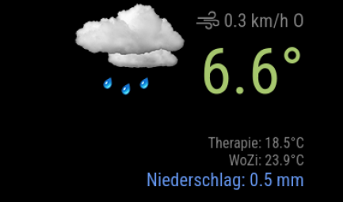

# MMM-My-Actual-Weather

**Stand: 05.02.2026**

MagicMirror² module displaying weather data from a Personal Weather Station (PWS) combined with CloudWatcher IR sky sensor data. Uses a weather aggregator backend that derives WMO weather codes locally from sensor data and pushes updates via MQTT.

## Features

- **MQTT Real-Time Updates**: Instant weather updates via MQTT when PWS pushes new data
- **Weather Aggregator Integration**: Receives weather data from central aggregator via MQTT (with API polling fallback)
- **CloudWatcher IR Sensor**: Sky temperature measurement for accurate cloud detection
- **Local WMO Code Derivation**: Weather conditions determined from actual sensor data (no external weather API needed)
- **Rain Sensor Heater Control**: Automatic heater management to keep rain sensor dry and accurate
- **Wunderground Fallback**: Automatic fallback when aggregator data is stale
- **Additional Sensors**: Support for up to 2 indoor temperature/humidity sensors
- **Temperature Color Gradient**: Temperature-dependent color display (configurable)
- **Day/Night Icons**: Automatic weather icon adjustment based on CloudWatcher daylight detection

## Documentation

- [Project Documentation](My-Actual-Weather-Projekt-Doku.md) - Internal project documentation (German)
- [Weather Aggregator](weather-aggregator/README.md) - Backend system documentation (PHP, PostgreSQL, MQTT)
- [WMO Code Derivation](weather-aggregator/docs/WMO_Ableitungsmoeglichkeiten.md) - Detailed WMO weather code derivation logic (German)
- [Heater-PWM Analysis](weather-aggregator/docs/Heater-PWM-Analyse.md) - Deep analysis of CloudWatcher rain sensor behavior (German)
- [CloudWatcher Integration](cloudwatcher/README.md) - CloudWatcher IR sensor service with heater control
- [CloudWatcher Project Documentation](cloudwatcher/cloudwatcher-projekt-dokumentation.md) - CloudWatcher planning and setup (German)
- [Rain Sensor Heater Control](cloudwatcher/InterfaceDocu/Heizungssteuerung.md) - Detailed heater algorithm and implementation (German)
- [Audit Log](AUDIT-Log-2026-01-30.md) - Quality audit results and fixes

## Architecture

```
┌─────────────┐  HTTP POST (every ~60-90s)
│  PWS        │ ─────────────────────────┐
│ (YOUR_PWS)  │                          │
└─────────────┘                          ▼
                            ┌────────────────────────────────────────┐
                            │  Weather Aggregator (Webserver)        │
                            │                                        │
┌─────────────┐  HTTP GET   │  pws_receiver.php                      │
│ CloudWatcher│ ◄───────────│    ├── Parse PWS data                  │
│  (IR Sensor)│             │    ├── Fetch CloudWatcher API          │
└─────────────┘             │    ├── Derive WMO code                 │
                            │    ├── Store in PostgreSQL             │
                            │    └── Publish to MQTT                 │
                            │                                        │
                            │  api.php → JSON API (fallback)         │
                            └────────────────────────────────────────┘
                                          │
                                          ▼ MQTT (real-time)
                            ┌────────────────────────────────────────┐
                            │  MagicMirror                           │
                            │    ├── Subscribe to MQTT topic         │
                            │    ├── Watchdog: Poll API if no MQTT   │
                            │    ├── Fallback: Wunderground API      │
                            │    └── Display weather data            │
                            └────────────────────────────────────────┘
```

## Screenshot



## Installation

```bash
cd ~/MagicMirror/modules
git clone https://github.com/rkorell/MMM-My-Actual-Weather.git
cd MMM-My-Actual-Weather
npm install
```

## Configuration

Add the following to your `config/config.js`:

```javascript
{
    module: "MMM-My-Actual-Weather",
    position: "top_right",
    config: {
        // Weather Aggregator (primary data source)
        aggregatorApiUrl: "http://YOUR_SERVER/weather-api/api.php?action=current",
        aggregatorFallbackTimeout: 180,  // Fallback after 180s stale data

        // MQTT real-time updates (aggregator publishes here after each PWS push)
        mqttServer: "mqtt://localhost:1883",  // Adjust if MQTT broker runs elsewhere
        mqttTopic: "weather/aggregator/new_data",
        mqttFallbackTimeout: 5 * 60 * 1000,  // Poll API if no MQTT for 5 minutes

        // Wunderground (fallback)
        stationId: "YOUR_STATION_ID",
        apiKey: "YOUR_PWS_API_KEY",
        wundergroundIconApiKey: "YOUR_V3_API_KEY",  // For icon lookup

        // Location (for Wunderground fallback icons)
        latitude: 50.242,
        longitude: 6.603,

        // Additional Sensors
        showSensor1: true,
        showSensor2: true,
        sensor1Name: "Living Room",
        sensor2Name: "Office",

        // Display
        lang: "de"
    }
}
```

## Configuration Options

### Aggregator Settings

| Option | Type | Default | Description |
|--------|------|---------|-------------|
| `aggregatorApiUrl` | String | - | URL to weather aggregator API (required) |
| `aggregatorFallbackTimeout` | Number | `180` | Seconds before switching to Wunderground fallback |

### MQTT Settings

The module receives real-time weather updates via MQTT. When a new PWS reading arrives at the aggregator, it publishes the full weather data to MQTT, and the module updates instantly.

| Option | Type | Default | Description |
|--------|------|---------|-------------|
| `mqttServer` | String | `"mqtt://localhost:1883"` | MQTT broker URL (adjust if broker runs elsewhere) |
| `mqttTopic` | String | `"weather/aggregator/new_data"` | Topic where aggregator publishes weather data |
| `mqttFallbackTimeout` | Number | `300000` | Poll API if no MQTT update within this time (ms, default 5 min) |

### Wunderground Fallback

| Option | Type | Default | Description |
|--------|------|---------|-------------|
| `stationId` | String | - | Wunderground Station ID |
| `apiKey` | String | - | Wunderground PWS API v2 Key |
| `wundergroundIconApiKey` | String | - | Wunderground v3 API Key (for icons) |
| `latitude` | Number | - | Latitude for icon lookup |
| `longitude` | Number | - | Longitude for icon lookup |
| `baseURL` | String | `https://api.weather.com/v2/pws/observations/current?format=json` | PWS API URL |

### Sensor Display

| Option | Type | Default | Description |
|--------|------|---------|-------------|
| `showSensor1` | Boolean | `false` | Show indoor sensor 1 |
| `showSensor2` | Boolean | `false` | Show indoor sensor 2 |
| `sensor1Name` | String | `"WoZi"` | Display name for sensor 1 |
| `sensor2Name` | String | `"Therapie"` | Display name for sensor 2 |
| `sensorTextColor` | String | `"lightgray"` | Text color for sensors |

### Display Options

| Option | Type | Default | Description |
|--------|------|---------|-------------|
| `decimalPlacesTemp` | Number | `1` | Decimal places for temperature |
| `decimalPlacesPrecip` | Number | `1` | Decimal places for precipitation |
| `windColor` | String | `"white"` | Color for wind display |
| `precipitationColor` | String | `"white"` | Color for precipitation |
| `temperatureColor` | String | `"white"` | Temperature color (when `tempSensitive: false`) |
| `tempSensitive` | Boolean | `true` | Enable temperature color gradient |
| `showDataSource` | Boolean | `true` | Show data timestamp |
| `animationSpeed` | Number | `1000` | Animation speed (ms) |
| `lang` | String | `config.language` | Language (de/en) |
| `units` | String | `"m"` | Units: `"m"` (metric), `"e"` (imperial) |

### Temperature Color Gradient

```javascript
tempColorGradient: [
    { temp: -20, color: "#b05899" },
    { temp: -14, color: "#6a4490" },
    { temp: -10, color: "#544691" },
    { temp: -5, color: "#484894" },
    { temp: -1, color: "#547bbb" },
    { temp: 4, color: "#70bbe8" },
    { temp: 8, color: "#c2ce2c" },
    { temp: 12, color: "#ecc82d" },
    { temp: 16, color: "#eebf2e" },
    { temp: 20, color: "#eec12c" },
    { temp: 24, color: "#e2a657" },
    { temp: 27, color: "#db8f32" },
    { temp: 30, color: "#bb5a20" },
    { temp: 32, color: "#c04117" }
]
```

## WMO Weather Code Derivation

The weather aggregator derives WMO codes locally from sensor data. For detailed derivation logic, see [WMO_Ableitungsmoeglichkeiten.md](weather-aggregator/docs/WMO_Ableitungsmoeglichkeiten.md).

| Condition | WMO Code | Derivation |
|-----------|----------|------------|
| Clear | 0 | Delta > 25°C |
| Mainly Clear | 1 | Delta > 18°C |
| Partly Cloudy | 2 | Delta > 8°C |
| Overcast | 3 | Delta ≤ 8°C |
| Haze | 4 | Humidity < 60% AND Delta > 15°C |
| Mist | 10 | Spread < 2°C AND Humidity 90-97% |
| Shallow Fog | 11 | Temp ≤ Dewpoint AND Wind < 1 m/s |
| Fog | 45 | Spread < 1°C AND Humidity > 97% AND Delta < 5°C |
| Rime Fog | 48 | Fog conditions AND Temp < 0°C |
| Drizzle | 51, 53 | Precip rate < 1.0 mm/h (light < 0.2, moderate 0.2-1.0) |
| Freezing Drizzle | 56, 57 | Drizzle AND Temp 0-0.5°C (light < 0.5, dense >= 0.5) |
| Rain | 61, 63, 65 | Precip rate >= 1.0 mm/h (slight/moderate/heavy) |
| Freezing Rain | 66, 67 | High precip rate near 0°C (temp -1 to 0.5°C, rate >= 1.0) |
| Sleet | 68, 69 | Precipitation AND Temp 1.5-3°C |
| Snow | 71, 73, 75 | Precipitation AND Temp < 1.5°C (certain at < -2°C) |
| Snow Grains | 77 | Precip < 0.2 mm/h AND Temp < -2°C |

**Delta** = Ambient temperature - Sky temperature (from CloudWatcher IR sensor)

**Spread** = Ambient temperature - Dewpoint

## Aggregator API Response

The module expects the following JSON structure from the aggregator API:

```json
{
    "timestamp": "2026-01-29T19:40:22+01:00",
    "temp_c": 1.0,
    "humidity": 99,
    "dewpoint_c": 0.86,
    "pressure_hpa": 1001.2,
    "wind_speed_ms": 2.4,
    "wind_dir_deg": 270,
    "precip_rate_mm": 0,
    "precip_today_mm": 3.1,
    "temp1_c": 21.5,
    "temp2_c": 19.8,
    "humidity1": 50,
    "humidity2": 36,
    "sky_temp_c": -8.5,
    "delta_c": 9.5,
    "rain_freq": 2048,
    "heater_pwm": 0,
    "rain_sensor_temp_c": 8.5,
    "esp_temp_shadow_c": 0.8,
    "esp_temp_sun_c": 3.2,
    "is_wet": false,
    "wmo_code": 3,
    "condition": "overcast",
    "is_raining": false,
    "is_daylight": true,
    "cloudwatcher_online": true,
    "data_age_s": 15
}
```

### Rain Sensor Fields

| Field | Type | Description |
|-------|------|-------------|
| `rain_freq` | Integer | CloudWatcher rain sensor frequency (< 1700=rain, 1700-2100=wet, > 2100=dry) |
| `heater_pwm` | Integer | Heater PWM value 0-1023 (controlled by cloudwatcher_service.py) |
| `rain_sensor_temp_c` | Float | Rain sensor NTC temperature (heater control feedback) |
| `esp_temp_shadow_c` | Float | ESP ambient temp (shadow sensor) - used for heater control |
| `esp_temp_sun_c` | Float | ESP ambient temp (sun-exposed sensor) - for comparison |
| `is_wet` | Boolean | True when rain_freq < 2100 (sensor surface is wet) |
| `is_raining` | Boolean | True when rain_freq < 1700 (active precipitation) |

**Note:** The heater is automatically controlled by the CloudWatcher service to keep the sensor 4-8°C above ambient temperature, preventing condensation and ensuring accurate rain detection. See [Heater Control Documentation](cloudwatcher/InterfaceDocu/Heizungssteuerung.md) for details.

### Fallback Logic

The module uses Wunderground as fallback in these cases:

1. **Data too old**: `data_age_s > aggregatorFallbackTimeout` (default 180s)
2. **CloudWatcher offline**: `cloudwatcher_online = false` (no WMO derivation possible)
3. **Aggregator unreachable**: Network error or API error

When fallback is triggered, the module fetches weather data and icons from the Wunderground API instead.

## Weather Aggregator Setup

The weather aggregator is a separate PHP application that runs on a webserver. See the `weather-aggregator/` directory for the source code.

### Components

| File | Description |
|------|-------------|
| `pws_receiver_post.php` | POST-to-GET adapter for Ecowitt protocol (Apache rewrites `/data/report/` to this) |
| `pws_receiver.php` | Main receiver logic: parses PWS data, fetches CloudWatcher, derives WMO, stores to DB, publishes to MQTT |
| `wmo_derivation.php` | WMO code derivation logic |
| `api.php` | JSON API for MagicMirror (fallback when MQTT unavailable) |
| `dashboard.php` | Web dashboard with charts and WMO icon overview |
| `config.php` | Configuration (thresholds, URLs, MQTT settings) |
| `db_connect.php` | Database credentials (not in Git) |

**Note:** The PWS uses Ecowitt protocol (HTTP POST), but `pws_receiver.php` expects GET parameters. The `pws_receiver_post.php` adapter converts POST body to `$_GET` and includes the main receiver.

### Deployment

1. Copy `weather-aggregator/` to your webserver (e.g., `/var/www/weather-api/`)
2. Create PostgreSQL database and user
3. Run `setup/schema.sql` to create tables
4. Copy `db_connect.example` to `db_connect.php` and enter credentials
5. Copy `config.example.php` to `config.php` and adjust settings (CloudWatcher IP, station height, sensor names)
6. Configure your PWS to push data using the Ecowitt protocol:
   - **Server IP/Hostname**: `YOUR_WEBSERVER_IP`
   - **Path**: `/data/report/`
   - **Port**: `8000`
   - **Upload Interval**: `60` seconds

### Dashboard

The aggregator includes a web dashboard for monitoring and feedback:

| URL | Description |
|-----|-------------|
| `/weather-api/dashboard.php` | Weather overview with 24h charts |
| `/weather-api/dashboard.php?tab=feedback` | WMO feedback input (OK/Wrong buttons) |
| `/weather-api/dashboard.php?tab=analyse` | Feedback analysis and threshold recommendations |
| `/weather-api/dashboard.php?tab=icons` | WMO icon reference (all mappings) |

### API Endpoints

| Endpoint | Method | Description |
|----------|--------|-------------|
| `api.php?action=current` | GET | Current weather data with WMO code |
| `api.php?action=history&hours=24` | GET | Historical data (1-168 hours) |
| `api.php?action=status` | GET | System status (last update, DB stats) |
| `api.php?action=raw` | GET | Last raw database row (Debug) |
| `api.php?action=feedback` | POST | Save feedback for current reading |
| `api.php?action=feedback_stats` | GET | Feedback statistics and recommendations |
| `api.php?action=wmo_list` | GET | WMO codes sorted by proximity to current |
| `api.php?action=apply_recommendations` | POST | Apply threshold changes to config.php (with backup) |

## Data Flow

```
PWS Push (every ~60-90s)
      │
      ▼
Aggregator (pws_receiver.php)
      ├── Parse PWS data (convert units)
      ├── Fetch CloudWatcher API
      ├── Calculate: dewpoint, pressure (QNH)
      ├── Derive WMO code from sensors
      ├── Store to PostgreSQL
      └── Publish full data to MQTT
              │
              ▼ MQTT (instant)
MagicMirror (node_helper.js)
      ├── Receive MQTT message with weather data
      ├── Watchdog: Poll API if no MQTT for 5 min
      ├── If data_age > 180s → Wunderground fallback
      ├── Map WMO code → weather icon
      └── Send to frontend
              │
              ▼
Frontend (MMM-My-Actual-Weather.js)
      └── Render weather display
```

### Update Flow

1. **Primary (MQTT)**: PWS pushes → Aggregator stores + publishes to MQTT → MagicMirror receives instantly
2. **Watchdog Fallback**: If no MQTT message received for 5 minutes, poll aggregator API
3. **Wunderground Fallback**: If aggregator data is older than 180s, switch to Wunderground API

## Icon Mapping

Weather icons are mapped from WMO codes using the `WmoToWeatherIcon` lookup table. Icons are from the Weather Icons font with day/night variants based on `is_daylight` from CloudWatcher.

## Dependencies

- `mqtt` - MQTT client for real-time weather updates
- `node-fetch` - HTTP requests for API polling (fallback)

## Debugging

```bash
# MagicMirror logs
pm2 logs MagicMirror --lines 50 | grep "MMM-My-Actual-Weather"

# Test aggregator API
curl -s "http://YOUR_SERVER/weather-api/api.php?action=current" | jq

# Check aggregator status
curl -s "http://YOUR_SERVER/weather-api/api.php?action=status" | jq

# Test CloudWatcher API
curl -s "http://CLOUDWATCHER_IP:5000/api/data" | jq
```

## Known Limitations

- **No thunderstorm detection**: No lightning sensor available (WMO 95-99 not derivable)
- **Wunderground fallback**: Does not include indoor sensors or CloudWatcher data
- **Rate limits**: Wunderground v3 API has 500 calls/day limit

## Changelog

| Date | Description |
|------|-------------|
| 2026-02-05 | ESP dual sensor support: both shadow and sun temps forwarded through pipeline and displayed in dashboard |
| 2026-02-04 | Rain sensor heater control: automatic PWM regulation based on ambient temp (ESP sensor) |
| 2026-02-03 | ~~Rain sensor heater detection~~ (removed - was based on incorrect assumptions) |
| 2026-02-02 | MQTT real-time updates: aggregator publishes to MQTT, watchdog fallback to API polling |
| 2026-01-30 | Snow/Freezing logic restructured: snow priority at temp < -2°C, WMO 11 before WMO 45 |
| 2026-01-30 | Feedback mechanism (OK/Wrong buttons, analysis tab, recommendations), dashboard cosmetics |
| 2026-01-30 | CloudWatcher offline fallback, WMO icon mapping fixes, Dashboard WMO Icons tab |
| 2026-01-28 | Switched to Weather-Aggregator architecture |
| 2026-01-29 | Added dewpoint calculation, pressure QNH, indoor humidity |
| 2026-01-18 | Dual weather provider support (WUnderground/OpenMeteo) |
| 2026-01-16 | Layout simplified (table instead of flex) |
| 2026-01-15 | State machine for PWS/API coordination |
| 2026-01-14 | Initial release with PWS push server |

## Author

Dr. Ralf Korell, 2025/2026

## License

MIT
